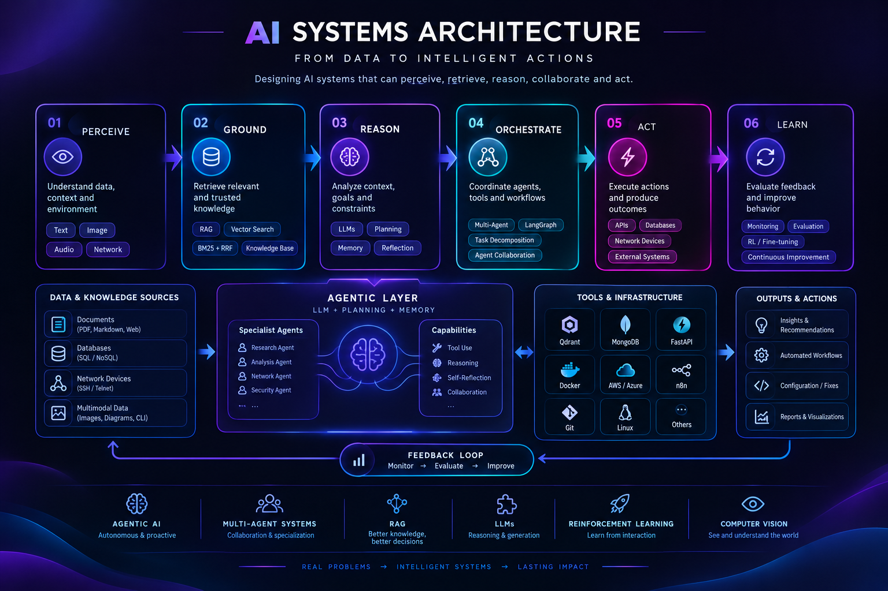

 

  

  

<!-- ═══════════════════════════════════════════════════════════════ -->

<!-- INTRO -->

<!-- ═══════════════════════════════════════════════════════════════ -->

<h2 align="center">👋 Hello, I'm Mariem</h2>

<table>
<tr>
<td width="850">

I'm an **ICT / Telecommunications Engineering Student at ENIT**, specializing in **Artificial Intelligence, Agentic AI and intelligent systems**.

I enjoy designing systems that combine **LLMs, retrieval, machine learning, computer vision and autonomous decision-making** to solve real-world problems.

My main area of interest is **Agentic AI**: building systems where AI agents can **reason, retrieve knowledge, interact with tools, coordinate tasks and take actions**.

Currently exploring:

**🤖 Agentic AI** · **🧩 Multi-Agent Systems** · **🧠 LLMs** · **🔎 RAG** · **🎯 Reinforcement Learning** · **👁️ Computer Vision**

</td>
</tr>
</table>

<!-- ═══════════════════════════════════════════════════════════════ -->

<!-- AI FOCUS -->

<!-- ═══════════════════════════════════════════════════════════════ -->

<h2 align="center">🧠 AI Focus</h2>

 

<table>
<tr>

<td align="center" width="25%">
<h3>🤖</h3>
<b>Agentic AI</b>
  
AI Agents
 
Tool Use
 
Autonomous Workflows
</td>

<td align="center" width="25%">
<h3>🧩</h3>
<b>Multi-Agent Systems</b>
  
LangGraph
 
Agent Orchestration
 
Task Decomposition
</td>

<td align="center" width="25%">
<h3>🔎</h3>
<b>Knowledge</b>
  
RAG
 
Vector Search
 
Multimodal Retrieval
</td>

<td align="center" width="25%">
<h3>🎯</h3>
<b>Autonomous AI</b>
  
Reinforcement Learning
 
Decision Making
 
Optimization
</td>

</tr>
</table>

<!-- ═══════════════════════════════════════════════════════════════ -->

<!-- FEATURED PROJECTS -->

<!-- ═══════════════════════════════════════════════════════════════ -->

<h2 align="center">🚀 Featured Projects</h2>

<table>
<tr>
<td width="50%">

<h3 align="center">🛰️ NetRAG</h3>

<b>Agentic AI for Network Engineering</b>

NetRAG is an **LLM-powered multi-agent assistant** for intelligent network engineering.

It combines:

* Multi-Agent Architecture
* LangGraph
* Multimodal RAG
* Hybrid Retrieval
* Qdrant
* Network Device Interaction
* AI-assisted Auditing

The system retrieves technical knowledge, analyzes network state and supports configuration validation and remediation.

</td>

<td width="50%">

<h3 align="center">💳 FinPredict AI</h3>

<b>Intelligent Credit Default Risk Platform</b>

A production-oriented ML platform combining:

* LightGBM
* Historical evidence retrieval
* SHAP explainability
* Calibration
* Drift Detection
* Model Monitoring
* Automated workflows

The project integrates **machine learning with retrieval-based historical evidence** for more informed and explainable risk assessment.

</td>
</tr>

<tr>
<td width="50%">

<h3 align="center">🛡️ Autonomous Network Defense</h3>

<b>Intrusion Detection & Response using Reinforcement Learning</b>

An autonomous RL agent modeled as a **Markov Decision Process**.

The agent learns to:

* Monitor traffic
* Detect suspicious behavior
* Raise alerts
* Isolate compromised nodes
* Restore hosts

Implemented and evaluated using:

**Monte Carlo · Temporal-Difference · Q-Learning**

with baseline comparison and safety constraints.

</td>

<td width="50%">

<h3 align="center">🔐 Secure Cloud MFA</h3>

<b>Biometric Multi-Factor Authentication</b>

A computer vision and cloud security system combining:

* Face Recognition
* Head Pose Estimation
* Liveness Detection
* QR-based MFA
* AWS S3
* DynamoDB
* AES-256
* HMAC-SHA-512

Designed to strengthen cloud data access while mitigating spoofing attacks.

</td>
</tr>
</table>

<!-- ═══════════════════════════════════════════════════════════════ -->

<!-- RESEARCH -->

<!-- ═══════════════════════════════════════════════════════════════ -->

<h2 align="center">🔬 Research & Exploration</h2>

<table>
<tr>
<td width="800">

### 🧠 Generative AI & Large Language Models

Research work exploring:

**Generative AI · LLMs · Transformer Architectures · Applications · Limitations · Challenges**

Also developed an **Image / Video-to-Text application** using **Google Vertex AI and Gemini** for visual analysis and text generation.

</td>
</tr>
</table>

<!-- ═══════════════════════════════════════════════════════════════ -->

<!-- TECH STACK -->

<!-- ═══════════════════════════════════════════════════════════════ -->

<h2 align="center">⚙️ Technology Stack</h2>

<h3 align="center">Programming</h3>

 

<h3 align="center">AI / Machine Learning</h3>

  

 

<h3 align="center">Data / AI Infrastructure</h3>

 

<h3 align="center">Development</h3>

 

<h3 align="center">Networking</h3>

<!-- ═══════════════════════════════════════════════════════════════ -->

<!-- AI ARCHITECTURE -->

<!-- ═══════════════════════════════════════════════════════════════ -->

<h2 align="center">🧬 AI Systems Architecture</h2>

  <i>From data to intelligent actions.</i>

 

 

  <b>Agentic AI</b> ·
  <b>Multi-Agent Systems</b> ·
  <b>LLMs</b> ·
  <b>RAG</b> ·
  <b>Reinforcement Learning</b> ·
  <b>Computer Vision</b>

<!-- ═══════════════════════════════════════════════════════════════ -->

<!-- GITHUB STATS -->

<!-- ═══════════════════════════════════════════════════════════════ -->

<h2 align="center">📊 GitHub Statistics</h2>

 

<!-- ═══════════════════════════════════════════════════════════════ -->

<!-- ACTIVITY GRAPH -->

<!-- ═══════════════════════════════════════════════════════════════ -->

<h2 align="center">📈 Contribution Activity</h2>

<!-- ═══════════════════════════════════════════════════════════════ -->

<!-- CONTRIBUTION SNAKE -->

<!-- ═══════════════════════════════════════════════════════════════ -->

<h2 align="center">🐍 Contributions</h2>

<!-- ═══════════════════════════════════════════════════════════════ -->

<!-- CURRENTLY LEARNING -->

<!-- ═══════════════════════════════════════════════════════════════ -->

<h2 align="center">🌌 Currently Exploring</h2>

<!-- ═══════════════════════════════════════════════════════════════ -->

<!-- EDUCATION -->

<!-- ═══════════════════════════════════════════════════════════════ -->

<h2 align="center">🎓 Education</h2>

**National Engineering School of Tunis — ENIT**

ICT / Telecommunications Engineering

**Focus:** AI · Machine Learning · Signal Processing · Computer Vision · Intelligent Communications · Networks · Cybersecurity

<!-- ═══════════════════════════════════════════════════════════════ -->

<!-- LOOKING FOR -->

<!-- ═══════════════════════════════════════════════════════════════ -->

<h2 align="center">🎯 Career Direction</h2>

I'm interested in opportunities at the intersection of:

**Agentic AI · Generative AI · Machine Learning · Multi-Agent Systems · Computer Vision · Intelligent Systems · AI Research**

  

Looking to contribute to projects where **AI is designed not only to predict or generate, but to reason, interact and act.**

<!-- ═══════════════════════════════════════════════════════════════ -->

<!-- FOOTER -->

<!-- ═══════════════════════════════════════════════════════════════ -->

 

### 🤖 Build Agents

### 🧠 Make Them Reason

### ⚡ Let Them Act

 

