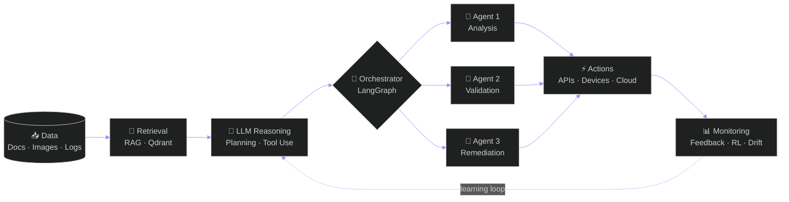

<!-- ═══════════ HEADER ═══════════ -->

 

  

  

<!-- ═══════════ ABOUT ═══════════ -->
<h2 align="center">👋 About Me</h2>

I'm an **ICT / Telecommunications Engineering student at ENIT**, specialized in **Artificial Intelligence and Agentic Systems**.

I design systems that combine **LLMs, retrieval, machine learning, computer vision and autonomous decision-making** to solve real-world problems, with a focus on **AI agents that reason, retrieve knowledge, use tools, coordinate and take action.**

 

 

| 🤖 **Agentic AI** | 🧩 **Multi-Agent Systems** | 🔎 **Knowledge** | 🎯 **Autonomous AI** |
|:---:|:---:|:---:|:---:|
| AI Agents | LangGraph | RAG | Reinforcement Learning |
| Tool Use | Orchestration | Vector Search | Decision Making |
| Autonomous Workflows | Task Decomposition | Multimodal Retrieval | Optimization |

<!-- ═══════════ PROJECTS ═══════════ -->
<h2 align="center">🚀 Featured Projects</h2>

<table>
<tr>
<td width="50%" valign="top">

<h3 align="center">🛰️ NetRAG</h3>

<b>Agentic AI for Network Engineering</b>

An **LLM-powered multi-agent assistant** that retrieves technical knowledge, analyzes network state, and supports configuration validation and remediation.

- 🧩 Multi-agent architecture with **LangGraph**
- 🔎 Multimodal & hybrid RAG on **Qdrant**
- 🔌 Live network device interaction
- 🛡️ AI-assisted auditing

</td>
<td width="50%" valign="top">

<h3 align="center">💳 FinPredict AI</h3>

<b>Intelligent Credit Default Risk Platform</b>

A production-oriented ML platform that pairs prediction with **retrieval of historical evidence** for explainable risk assessment.

- ⚡ **LightGBM** + probability calibration
- 🔍 **SHAP** explainability
- 📉 Drift detection & model monitoring
- 🔁 Automated workflows

</td>
</tr>
<tr>
<td width="50%" valign="top">

<h3 align="center">🛡️ Autonomous Network Defense</h3>

<b>Intrusion Detection & Response with RL</b>

An autonomous agent modeled as a **Markov Decision Process** that learns to monitor traffic, detect threats, raise alerts, isolate compromised nodes and restore hosts.

- 🎲 **Monte Carlo · TD · Q-Learning**
- 📊 Baseline comparison
- 🔒 Safety constraints

</td>
<td width="50%" valign="top">

<h3 align="center">🔐 Secure Cloud MFA</h3>

<b>Biometric Multi-Factor Authentication</b>

A computer vision and cloud security system that strengthens data access and mitigates spoofing attacks.

- 👤 Face recognition, head pose & **liveness detection**
- 📱 QR-based MFA
- ☁️ **AWS S3 + DynamoDB**
- 🔑 **AES-256 · HMAC-SHA-512**

</td>
</tr>
</table>

<!-- ═══════════ RESEARCH ═══════════ -->
<h2 align="center">🔬 Research & Exploration</h2>

**Generative AI · LLMs · Transformer Architectures · Applications · Limitations · Challenges**

Also built an **Image / Video-to-Text application** with **Google Vertex AI & Gemini** for visual analysis and text generation.

<!-- ═══════════ ARCHITECTURE (rendu natif par GitHub, animé au survol) ═══════════ -->
<h2 align="center">🧬 AI Systems Architecture</h2>

<i>From data to intelligent actions.</i>

<!-- ═══════════ TECH STACK ═══════════ -->
<h2 align="center">⚙️ Technology Stack</h2>

**Programming** 

  

**AI / Machine Learning** 
 

  

**Data / AI Infrastructure** 

  

**Development** 

  

**Networking** 

<!-- ═══════════ STATS ═══════════ -->
<h2 align="center">📊 GitHub Analytics</h2>

 

<h2 align="center">🐍 Contribution Snake</h2>

<picture>
  <source media="(prefers-color-scheme: dark)" srcset="https://raw.githubusercontent.com/rebhimariem27-tech/rebhimariem27-tech/output/github-snake-dark.svg">
  <source media="(prefers-color-scheme: light)" srcset="https://raw.githubusercontent.com/rebhimariem27-tech/rebhimariem27-tech/output/github-snake.svg">
  
</picture>

<!-- ═══════════ EXPLORING ═══════════ -->
<h2 align="center">🌌 Currently Exploring</h2>

<!-- ═══════════ EDUCATION ═══════════ -->
<h2 align="center">🎓 Education</h2>

**National Engineering School of Tunis (ENIT)** 
ICT / Telecommunications Engineering

**Focus:** AI · Machine Learning · Signal Processing · Computer Vision · Intelligent Communications · Networks · Cybersecurity

<!-- ═══════════ CAREER ═══════════ -->
<h2 align="center">🎯 Career Direction</h2>

Open to opportunities at the intersection of

**Agentic AI · Generative AI · Machine Learning · Multi-Agent Systems · Computer Vision · AI Research**

 

> *Building AI that doesn't just predict or generate, but reasons, interacts and acts.*

 

  

### 🤖 Build Agents &nbsp;·&nbsp; 🧠 Make Them Reason &nbsp;·&nbsp; ⚡ Let Them Act

 

